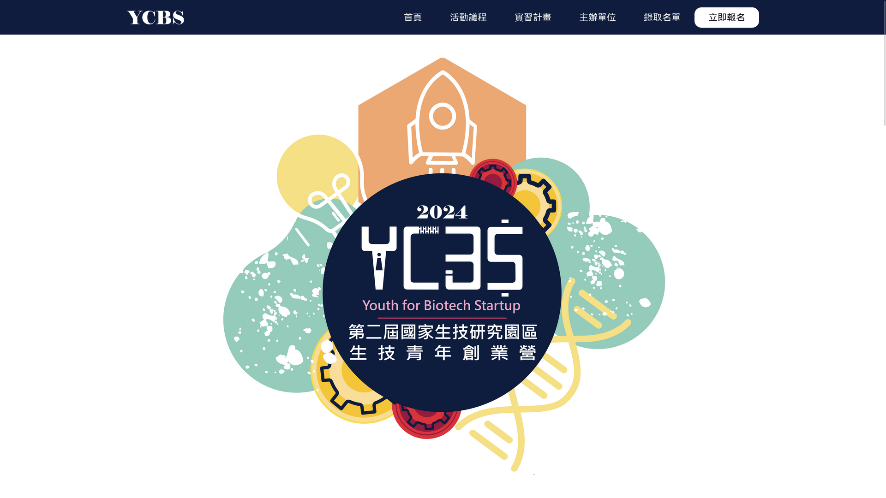
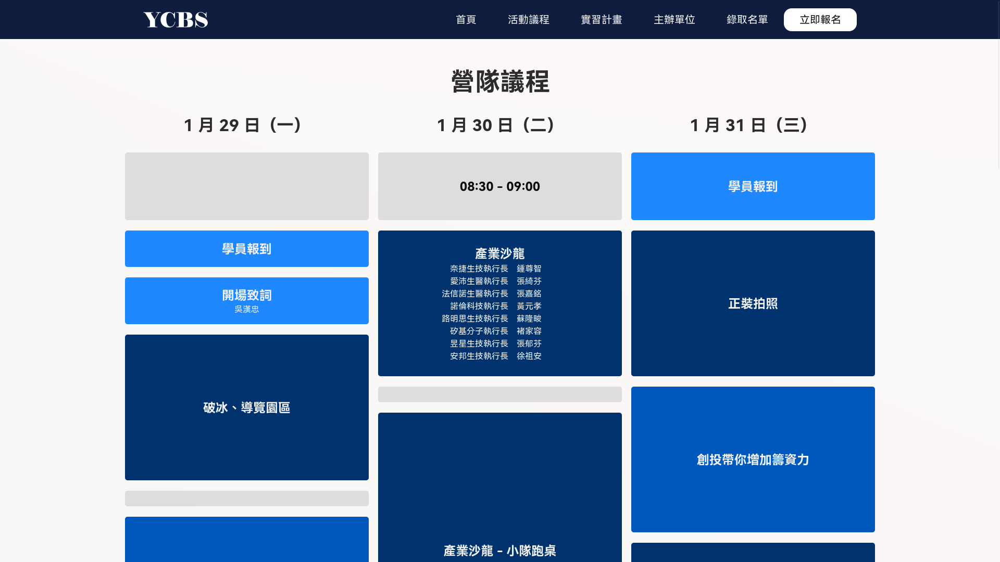

# YCBS 2024 介紹網站

使用 Python Frozen-Flask





## Setup up environment

```
python3 -m venv venv
. venv/bin/activate # on Linux, MacOS; or
. venv\Scripts\activate # on Windows
pip install -r dependencies.txt
```

## Run

```
python app.py
```

## Build

```
FLASK_APP=app.py flask freeze
```
